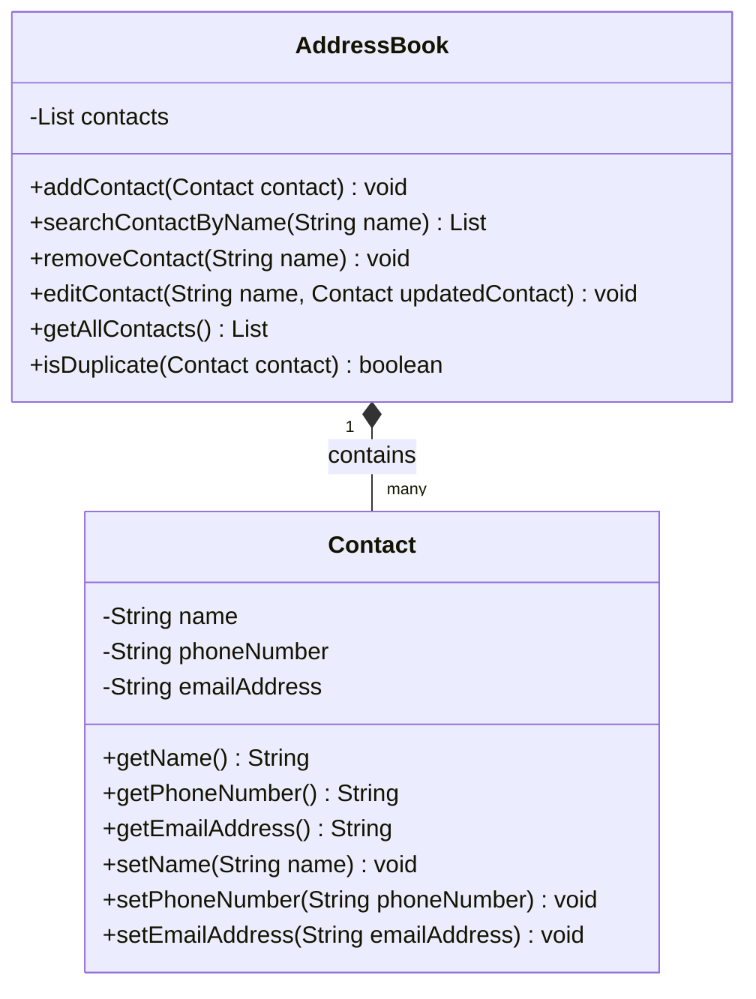

 ```
            /;
           / |'-,.
          /  '    `"---,.__
         /  '    ,'     ,  '"--,"|
        /  '    ,     ,'     ,"::|
       /  '   ,'    ,      ,"::::|
      /  '   ,    ,'     ,"::::::L
     /  '  ,'   ,'     ,"::::::::L
    /  '  ,    ,     ,":::::::::J
    k-,._    ,'   _.":::::::::::J
     \.  `"----'"".J::::::::::::|
      \.    .-,    .L:::::::::::|
       \.  (       .J:::::::::::!
        \.  `--     .L:::::::::/
         \.   .-.   .|::::::::/
          \. (   )  .J:::::::/
           \. `-'    .L:::::/
            \.  L    .|::::/
             \. !__  .J:::/
              \.  __  .L:/
               \. L_) .|/
                `-,__,-'    
```

# Address Book (Java)

## Benefits of the Software

### Problem the Software Will Solve
In today's digital age, efficient and effective management of contact information is crucial for any business. The Address Book application will solve the problem of managing multiple contact details by providing a centralized platform. This will help in reducing the hassle of managing contacts through traditional methods like physical address books or scattered digital solutions, which are prone to errors and inefficiencies.

### Benefits to the User
- **Organization**: Users can easily store and retrieve contact details, keeping their network well-organized.
- **Accessibility**: Contacts can be accessed from anywhere, as long as the user can interact with the application, enhancing flexibility and mobility.
- **Efficiency**: Quick search functionalities for finding contact details by name, phone number, or email address save time and improve productivity.
- **Reliability**: By implementing checks against duplicate entries, the application ensures data integrity and reliability.

### Impact on the Customer's Business
For DFCorp, offering an Address Book application can lead to:
- **Customer Satisfaction**: Providing a useful tool that addresses specific client needs can enhance customer satisfaction and loyalty.
- **Market Expansion**: Introducing a new product in their portfolio opens up additional market opportunities and potential revenue streams.
- **Brand Reputation**: By providing an efficient and robust application, DFCorp can enhance its reputation as a reliable software provider.

## User Stories

1. **Add a Contact**
   - As a user, I want to add a contact with a name, phone number, and email address so that I can save their information in the address book.

2. **Search for a Contact by Name**
   - As a user, I want to search for a contact by name so that I can find their details quickly.

3. **Remove a Contact**
   - As a user, I want to remove a contact from the address book so that I can delete outdated or incorrect information.

4. **Edit a Contact's Details**
   - As a user, I want to edit a contact's details so that I can update their information when necessary.

5. **Ensure No Duplicate Phone Numbers or Email Addresses**
   - As a user, I want the system to prevent duplicate phone numbers or email addresses so that I avoid conflicts and errors.

6. **View All Contacts**
   - As a user, I want to view all contacts in the address book so that I can see all saved information in one place.

## Domain Models and Class Diagrams

### Classes and Attributes

1. **Contact**
   - Attributes:
      - `name`: String
      - `phoneNumber`: String
      - `emailAddress`: String
   - Methods:
      - `getName()`: String
      - `getPhoneNumber()`: String
      - `getEmailAddress()`: String
      - `setName(String name)`: void
      - `setPhoneNumber(String phoneNumber)`: void
      - `setEmailAddress(String emailAddress)`: void

2. **AddressBook**
   - Attributes:
      - `contacts`: List<Contact>
   - Methods:
      - `addContact(Contact contact)`: void
      - `searchContactByName(String name)`: List<Contact>
      - `removeContact(String name)`: void
      - `editContact(String name, Contact updatedContact)`: void
      - `getAllContacts()`: List<Contact>
      - `isDuplicate(Contact contact)`: boolean

### Class Diagrams



## Testing the Application

### Test Cases for Adding a Contact

These test cases belong to `AddressBookTest`.

1. **Test Adding a Valid Contact**
    - **Act**: Add a valid contact to the address book using `addContact`.
    - **Assert**: Verify that the contact was added correctly by checking:
        - The size of the contact list.
        - The details of the added contact.

2. **Test Adding a Contact with Missing Name**
    - **Act & Assert**: Attempt to add a contact with a missing name and ensure an `IllegalArgumentException` is thrown.

3. **Test Adding a Contact with Missing Phone Number**
    - **Act & Assert**: Attempt to add a contact with a missing phone number and ensure an `IllegalArgumentException` is thrown.

4. **Test Adding a Contact with Missing Email Address**
    - **Act & Assert**: Attempt to add a contact with a missing email address and ensure an `IllegalArgumentException` is thrown.

5. **Test Adding a Duplicate Contact**
    - **Act**: Add a contact to the address book.
    - **Assert**: Attempt to add a second contact with the same phone number as the first, ensuring an `IllegalArgumentException` is thrown.
    - **Assert**: Attempt to add a third contact with the same email address as the first, ensuring an `IllegalArgumentException` is thrown.

6. **Test Retrieving Added Contact**
    - **Act**: Add a contact to the address book using `addContact`.
    - **Assert**: Retrieve the contact from the address book and verify that its details are correct.

### Test Cases for Contact Validations

These test cases belong to `ContactTest`.

1. **Test Creating a Valid Contact**
    - **Act**: Initialize the contact with valid data.
    - **Assert**: Verify that the contact is created with the correct details.

2. **Test Creating a Contact with Missing Name**
    - **Act & Assert**: Ensure that an `IllegalArgumentException` is thrown when a contact with a missing name is created.

3. **Test Creating a Contact with Missing Phone Number**
    - **Act & Assert**: Ensure that an `IllegalArgumentException` is thrown when a contact with a missing phone number is created.

4. **Test Creating a Contact with Missing Email Address**
    - **Act & Assert**: Ensure that an `IllegalArgumentException` is thrown when a contact with a missing email address is created.

5. **Test Setting and Getting Name**
    - **Act**: Set the contact name.
    - **Assert**: Verify that the contact name was set and can be retrieved correctly.

6. **Test Setting and Getting Phone Number**
    - **Act**: Set the contact phone number.
    - **Assert**: Verify that the contact phone number was set and can be retrieved correctly.

7. **Test Setting and Getting Email Address**
    - **Act**: Set the contact email address.
    - **Assert**: Verify that the contact email address was set and can be retrieved correctly.

### Additional Test Cases for AddressBook

1. **Test Searching Contact by Name**
    - **Act**: Search for the contact by name using `searchContactByName`.
    - **Assert**: Verify that the contact with the target name is returned in the search results.

2. **Test Searching Contact by Phone Number**
    - **Act**: Search for the contact by phone number using `searchContactByPhoneNumber`.
    - **Assert**: Verify that the contact with the target phone number is returned in the search results.

3. **Test Searching Contact by Email Address**
    - **Act**: Search for the contact by email address using `searchContactByEmailAddress`.
    - **Assert**: Verify that the contact with the target email address is returned in the search results.

4. **Test Searching Contacts Sorted by Name**
    - **Act**: Search for contacts sorted by name using `searchContactsSorted`.
    - **Assert**: Verify that the contacts are returned in the correct sorted order.

5. **Test Deleting All Contacts**
    - **Act**: Add multiple contacts to the address book.
    - **Assert**: Delete all contacts using `deleteAllContacts` and verify that the contact list is empty.

6. **Test Checking for Duplicate Contacts**
    - **Act**: Add a contact to the address book.
    - **Assert**: Check for duplicates using `isDuplicate` and verify that duplicates are correctly identified.

7. **Test Removing a Contact**
    - **Act**: Add a contact to the address book.
    - **Assert**: Remove the contact using `removeContact` and verify that the contact is removed.

8. **Test Editing a Contact's Details**
    - **Act**: Add a contact to the address book.
    - **Assert**: Edit the contact's details using `editContact` and verify that the details are updated correctly.

9. **Test Viewing all Contacts**
    - **Act**: Add multiple contacts to the address book.
    - **Assert**: Check if application correctly displays all contacts.

## Run the Application on the Console
 
    run 'mvn test'
    run 'mvn compile'

    By default the app runs with a few examples on the Contact list.